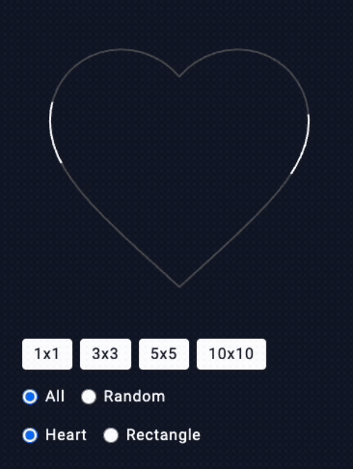

# vue3-border-beam



# 功能

* 走線動畫
* 4種格子數量切換模式(1x1、3x3、5x5、10x10)
* 2種顯示模式切換 (All、Random)
* 2種形狀模式切換 (Heart、Rectangle)

### P.S.
* BorderBeamB 使用animateMotion的方法完成效果
* BorderBeamA 使用offset-path的方法完成但無法實現心形

## Project Setup

```sh
npm install
```

### Compile and Hot-Reload for Development

```sh
npm run dev
```

### Type-Check, Compile and Minify for Production

```sh
npm run build
```
